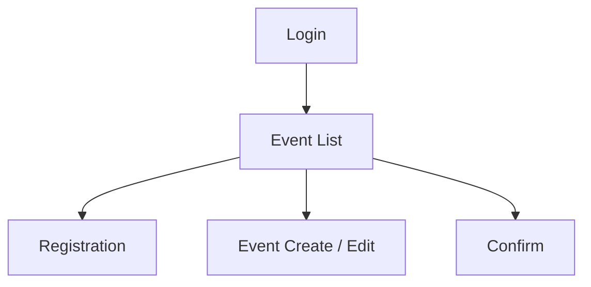
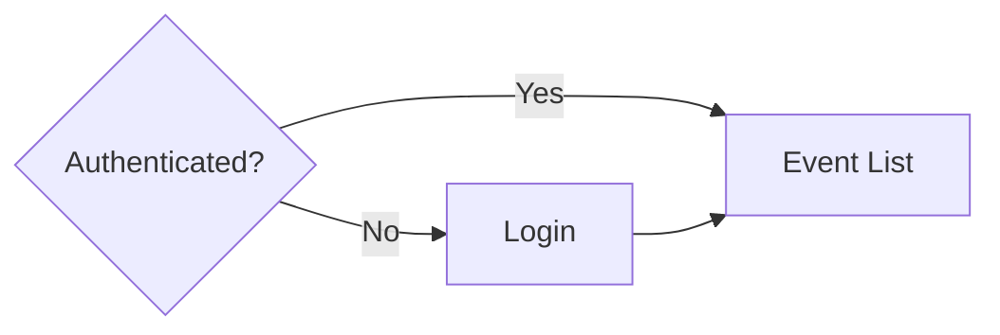
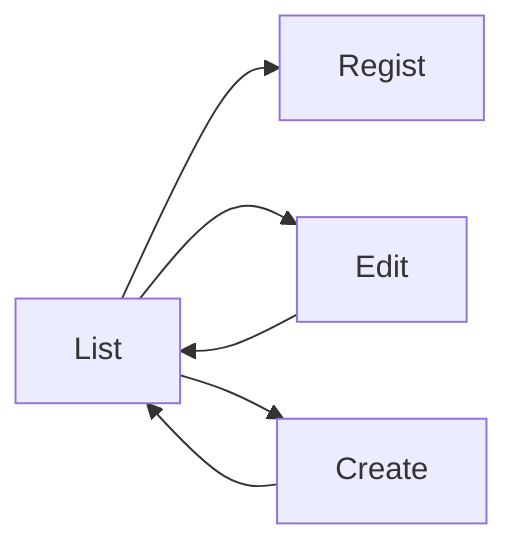
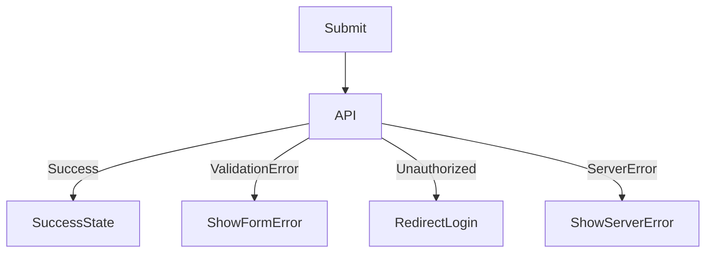

# 🖥️ 画面遷移

---

# 設計前提

| 項目     | 内容                            |
| ------ | ----------------------------- |
| 対象ユーザー | 一般ユーザー / 管理者 |
| デバイス   | Responsive |
| 認証要否   | 全面認証制 |
| 権限制御   | RBAC |
| MVP範囲  | P0画面のみ |

---

# 画面一覧（Screen Inventory）

| ID   | 画面名     | 役割     | 認証  | 優先度 |
| ---- | ------- | ------ | --- | --- |
| S-01 | ログイン | 認証 | 不要  | P0  |
| S-02 | イベント一覧画面 | (作成済みの)イベント一覧 | 必須  | P0  |
| S-03 | 支払い登録画面 | 支払い情報入力 | 必須  | P0  |
| S-04 | 支払い記録画面 | 支払い情報の確認と支払い済みの記録 | 必須  | P0  |
| S-05 | イベント作成/編集画面 | イベントデータ変更 | 必須  | P1  |

---

# 全体遷移図（高レベル）



---

# 認証フロー



---

# CRUD標準遷移テンプレ



---

# エラーフロー



---

# URL設計テンプレ

```
/login
/events
/events/:event_id/regist
/events/:event_id/confirm
/events/create
/events/:event_id/edit
```
