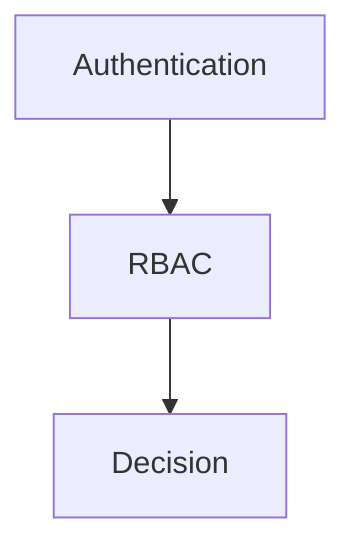

# 🔐 権限設計

---

# 設計前提

| 項目      | 内容                               |
| ------- | -------------------------------- |
| 権限モデル   | RBAC |
| マルチテナント | なし |
| 認証方式    | JWT / OAuth |
| スコープ単位  | Global |
| MVP方針   | P0は最小ロールのみ                       |

---

# 用語定義

| 用語       | 意味                                |
| -------- | --------------------------------- |
| Subject  | 操作主体（User / System）               |
| Resource | 操作対象（Entity）                      |
| Action   | 操作内容（create/read/update/delete 等） |
| Role     | 権限グループ                            |
| Policy   | 条件付き許可ルール                         |

---

# 権限レイヤー構造



---

# RBAC設計テンプレ

## グローバルロール

| ロール名        | 説明     |
| ----------- | ------ |
| ADMIN | 全操作可能  |
| MEMBER      | 支払い登録のみ |

---

## RBAC判定ロジック（抽象）

```pseudo
if user.discord_roles.include(allowed_role):
    allow
else:
    deny
```

---

# 代表的ルールテンプレ

### 1. 所有者のみ編集可

```pseudo
if resource.user_id == user.id:
    allow
```

---

### 2. 自分のデータのみ閲覧

```pseudo
if resource.user_id == user.id:
    allow
```

---


# ログ設計

## 監査ログ

| フィールド  | 内容        |
| ------ | --------- |
| who    | user      |
| what   | action    |
| where  | resource  |
| result | decision  |
| ip     | client_ip |

---

# フロントエンド制御

| パターン | 説明         |
| ---- | ---------- |
| 非表示  | ボタンを出さない   |
| 無効化  | disabled表示 |

※ フロントはUX制御のみ。最終判定は必ずサーバー側。
