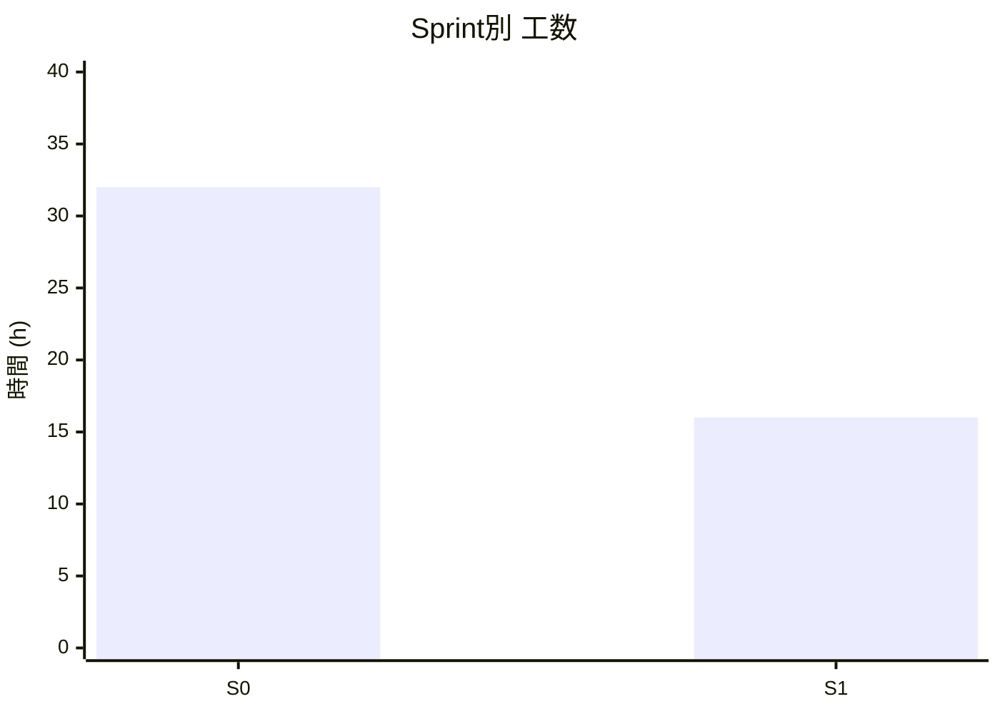
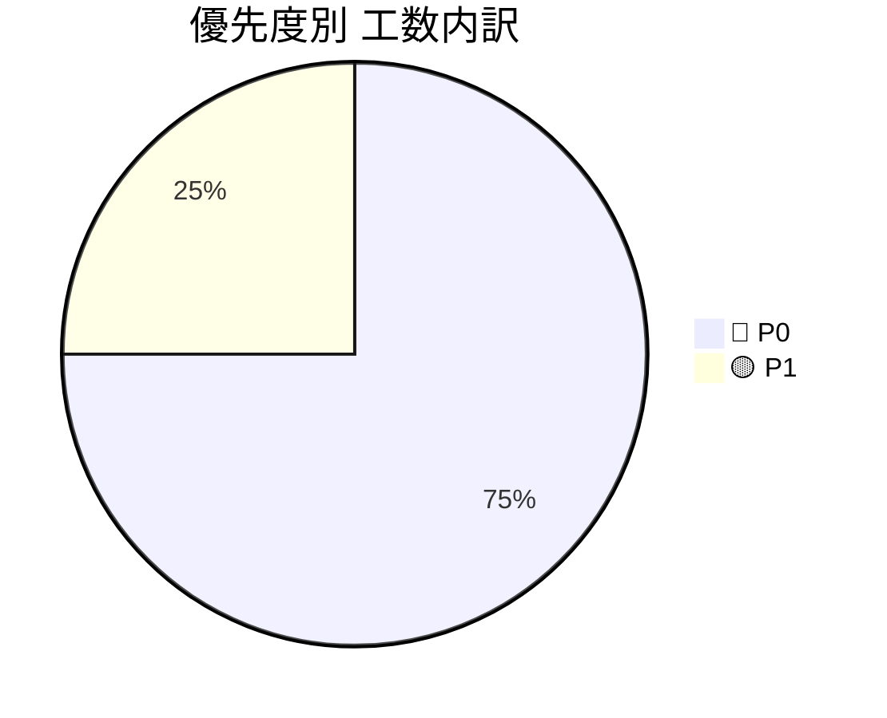
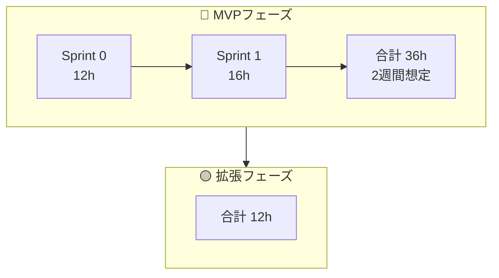

# 🚀 プロジェクトIssue管理テンプレート（工数見積もり付き）

---

## 📌 前提条件

* **1人日 = 8時間**
* 想定チーム規模：2名、混在
* 見積単位：

  * XS = 2h
  * S = 4h
  * M = 8h
  * L = 16h
  * XL = 24h以上
* 優先度ラベル：

  * 🔴 P0：MVP必須
  * 🟡 P1：早期追加
  * 🟢 P2：中期対応
  * ⚪ P3：将来構想
  
## 3月 スケジュール

A:永友
B:大塚

| 凡例 | 内容 |
|------|------|
| ○ | 作業可能(5時間) |
| △ | 作業可能(2～3時間) |
| × | 作業不可 |

| 月 | 火 | 水 | 木 | 金 | 土 | 日 |
|:---:|:---:|:---:|:---:|:---:|:---:|:---:|
|  |  |  |  |  |  | **1** A: × B: × |
| **2** A: × B: × | **3** A: × B: × | **4** A: × B: × | **5** A: × B: × | **6** A: × B: × | **7** A: × B: × | **8** A: × B: × |
| **9** A: × B: × | **10** A: × B: × | **11** A: ○ B: ○ | **12** A: ○ B: ○ | **13** A: × B: ○ | **14** A: × B: × | **15** A: × B: × |
| **16** A: △ B: × | **17** A: ○ B: × | **18** A: ○ B: × | **19** A: ○ B: × | **20** A: × B: ○ | **21** A: × B: × | **22** A: ○ B: ○ |
| **23** A: ○ B: ○ | **24** A: ○ B: ○ | **25** A: △ B: ○ | **26** A: △ B: △ | **27** A: ○ B: ○ | **28** | **29** |
| **30** | **31** | | | | | |

---

# Sprint別 Issue一覧テンプレート

---

## Sprint 0：コア機能

### 推定合計：32h

| #    | タイトル          | 工数 | 時間      | 優先度   | 担当    | 備考 |
| ---- | ------------- | -- | ------- | ----- | ----- | -- |
| #001 | 支払いユーザーリスト閲覧 | S | 4h | 🔴 P0 | BE/FE |    |
| #002 | 支払い記録 | S  | 4h | 🔴 P0 | BE/FE |    |
| #003 | 支払い登録 | M  | 8h | 🔴 P0 | BE/FE |    |
| #004 | イベントリスト閲覧 | S  | 4h | 🔴 P0 | BE/FE |    |
| #005 | イベント作成 | M  | 8h | 🟡 P1 | BE/FE |    |
| #006 | 支払い情報検索 | S  | 4h | 🟡 P1 | BE/FE |    |
|      | **Sprint 合計** |    | **32h** |       |       |    |
|      | **（P0のみ）**    |    | **20h** |       |       |    |

## Sprint 1：認証機能

### 推定合計：16h

| #    | タイトル          | 工数 | 時間      | 優先度   | 担当    | 備考 |
| ---- | ------------- | -- | ------- | ----- | ----- | -- |
| #007 | OAuthログイン | M | 8h | 🔴 P0 | BE/FE |    |
| #008 | 画面単位のアクセス制御 | S  | 4h | 🔴 P0 | BE/FE |    |
| #009 | ログイン状態の保持 | S  | 4h | 🔴 P0 | BE/FE |    |
|      | **Sprint 合計** |    | **16h** |       |       |    |
|      | **（P0のみ）**    |    | **16h** |       |       |    |

---

# 📊 工数サマリー

## Sprint別工数

---

## 優先度別内訳

---

# 🗓️ フェーズ分解テンプレート

